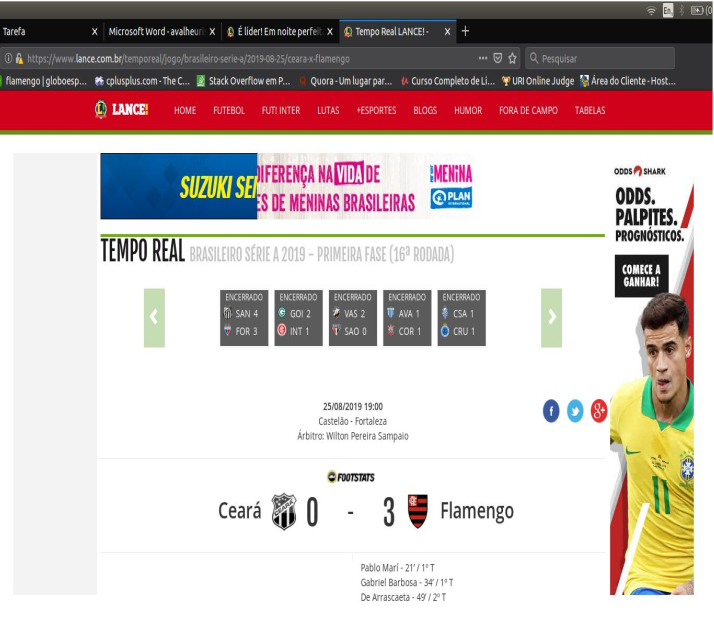
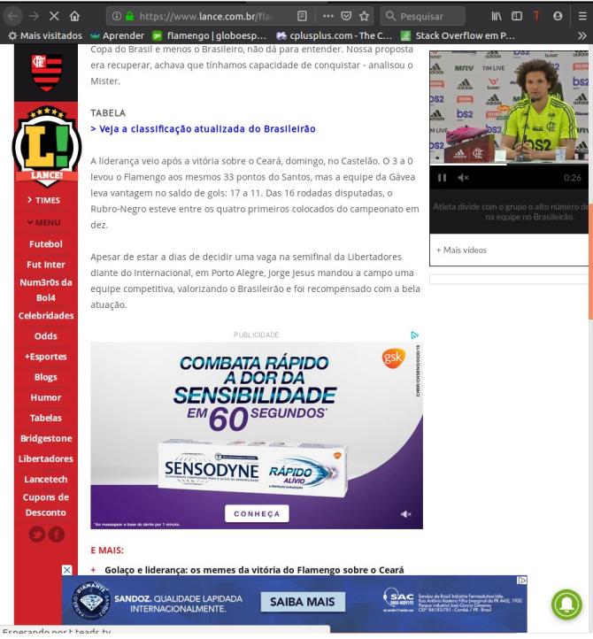
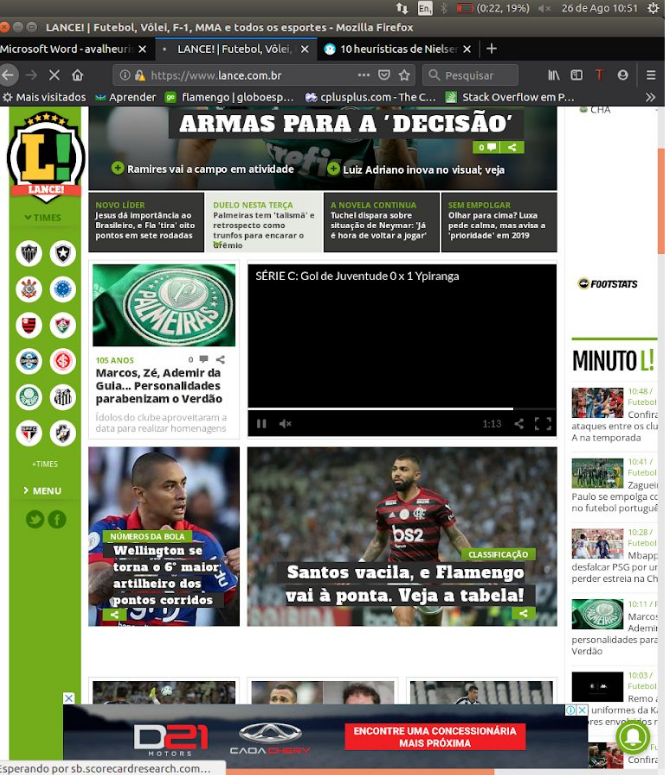

# Avaliação Heurística

## 1. Introdução

Normalmente o design, limitado ao lado visual das interfaces, é aplicado por último em um projeto, no entanto, é necessário compreender que desenvolvimento e design caminham juntos. O fato é que uma interface mal projetada resultará em uma má experiência de uso, portanto é necessário considerar o design antes, durante e depois do desenvolvimento de um projeto. Pensando nesses problemas o grande pai da usabilidade, Mr. Jakob Nielsen criou o que chamamos de: 10 heurísticas de Nielsen, algo que vemos bastante na engenharia. 

## 2. 10 Heurísticas de Nielsen

Utilizamos as 10 heurísticas de Nielsen para analisar o site Lance, afim de detectar problemas na interface.

|Status do sistema|
|------|
|**Verificação**|
|O sistema sempre deve informar ao usuário o que está acontecendo no momento da interação.|
|**Grau de Severidade**|
|&#9744; Sem importância &#9744; Cosmético &#9745; Simples &#9744; Grave &#9744; Catastrófico|
|**Natureza do problema**| 
|&#9744; Barreira &#9744; Obstáculo &#9745; Ruído|
|**Pespectiva do usuário**| 
|&#9745; Problema geral &#9744; Problema Preliminar &#9744; Problema Especial|
|**Pespectiva da tarefa**| 
|&#9745; Problema principal &#9744; Problema secundário|
|**Pespectiva do projeto**| 
|&#9745; Problema falso &#9744; Problema verdadeiro &#9744; Não se aplica|
|**Descrição do problema**|
|Contexto:​ O usuário acessou a página principal (​figura 1) ​ do site e o mesmo informou que havia um conteúdo carregando. Causa​: Lentidão na internet ou do próprio site. Efeito sobre o usuário​: Usuário fica ciente que algo ainda está carregando.|

|Compatibilidade do sistema com o mundo real|
|------|
|**Verificação**|
|​Toda comunicação do produto deve falar a linguagem do usuário e não ser orientada ao sistema, ou seja, não devemos usar linguagem técnica.|
|**Grau de Severidade**|
|&#9744; Sem importância &#9744; Cosmético &#9744; Simples &#9745; Grave &#9744; Catastrófico|
|**Natureza do problema**| 
|&#9744; Barreira &#9745; Obstáculo &#9744; Ruído|
|**Pespectiva do usuário**| 
|&#9745; Problema geral &#9744; Problema Preliminar &#9744; Problema Especial|
|**Pespectiva da tarefa**| 
|&#9745; Problema principal &#9744; Problema secundário|
|**Pespectiva do projeto**| 
|&#9744; Problema falso &#9744; Problema verdadeiro &#9745; Não se aplica|
|**Descrição do problema**|
|Contexto:​ ​O usuário acessou uma enquete (​figura 2) e se deparou com a opção de "Ver resultados". Causa:​ O sistema usa a linguagem voltada para o usuário. Efeito sobre o usuário​: Usuário compreende melhor o sistema. Efeito sobre a tarefa​: Facilita a utilização.|

|Controle do usuário e liberdade|
|------|
|**Verificação**|
|Nunca devemos impor algo ao usuário. Também nunca devemos tomar a decisão por ele. O ideal é sugerir e não induzir.|
|**Grau de Severidade**|
|&#9744; Sem importância &#9744; Cosmético &#9745; Simples &#9744; Grave &#9744; Catastrófico|
|**Natureza do problema**| 
|&#9744; Barreira &#9744; Obstáculo &#9745; Ruído|
|**Pespectiva do usuário**| 
|&#9745; Problema geral &#9744; Problema Preliminar &#9744; Problema Especial|
|**Pespectiva da tarefa**| 
|&#9744; Problema principal &#9745; Problema secundário|
|**Pespectiva do projeto**| 
|&#9745; Problema falso &#9744; Problema verdadeiro &#9744; Não se aplica|
|**Descrição do problema**|
|Contexto:​ O usuário está navegando pela página quando aparece uma frase (​figura 3) que o induz a clicar no link. Causa:​ De certa forma o sistema está impondo ao usuário o que fazer, quando nunca devemos fazer isso. Efeito sobre o usuário​: Desorientação. Efeito sobre a tarefa​: Perda de tempo. Correção possível​: Modificar o link, apenas sugerindo ao usuário.|

|Consistência e padrões|
|------|
|**Verificação**|
|Os itens são agrupados logicamente e os padrões de formatação são seguidos consistentemente em todas as telas da interface?|
|**Grau de Severidade**|
|&#9744; Sem importância &#9744; Cosmético &#9744; Simples &#9745; Grave &#9744; Catastrófico|
|**Natureza do problema**| 
|&#9744; Barreira &#9745; Obstáculo &#9744; Ruído|
|**Pespectiva do usuário**| 
|&#9745; Problema geral &#9744; Problema Preliminar &#9744; Problema Especial|
|**Pespectiva da tarefa**| 
|&#9745; Problema principal &#9744; Problema secundário|
|**Pespectiva do projeto**| 
|&#9744; Problema falso &#9744; Problema verdadeiro &#9745; Não se aplica|
|**Descrição do problema**|
|Contexto: O usuário clicou no ícone do clube localizado na barra de navegação lateral (figura 2). A página mostrada na figura 4 foi exibida, onde a barra de navegação passou para parte superior. Causa:​ Existem duas localizações diferentes para barra de navegação,, mas ambos apontam para a mesma página. Efeito sobre o usuário​: Desorientação. Efeito sobre a tarefa​: Perda de tempo. Correção possível​: Definir um local fixo para a barra de navegação..|

|Prevenção de erros|
|------|
|**Verificação**|
|O usuário pode cometer erros que poderiam ser prevenidos? Os cursores podem ser posicionados somente em áreas editáveis pelo usuário e as áreas protegidas são completamente inacessíveis?|
|**Grau de Severidade**|
|&#9744; Sem importância &#9744; Cosmético &#9744; Simples &#9745; Grave &#9744; Catastrófico|
|**Natureza do problema**| 
|&#9744; Barreira &#9745; Obstáculo &#9744; Ruído|
|**Pespectiva do usuário**| 
|&#9745; Problema geral &#9744; Problema Preliminar &#9744; Problema Especial|
|**Pespectiva da tarefa**| 
|&#9745; Problema principal &#9744; Problema secundário|
|**Pespectiva do projeto**| 
|&#9744; Problema falso &#9744; Problema verdadeiro &#9745; Não se aplica|
|**Descrição do problema**|
|Contexto: O usuário clicou no ícone do ​ “Flamengo” localizado na barra de navegação lateral esquerda. A página mostrada na figura 5 foi exibida. Logo em seguida o usuário clicou na palavra ​ “Flamengo” localizado na parte superior, e a mesma página foi carregada novamente. Causa: Existem dois ​ hiperlinks ​ na página que possuem representação gráfica e hierarquia diferentes, mas ambos apontam para a mesma página. Efeito sobre o usuário​: Desorientação. Efeito sobre a tarefa​: Perda de tempo. Correção possível​: Eliminar o hiperlink da palavra “Flamengo” da parte superior da página.|

|Reconhecimento ao invés de lembrança|
|------|
|**Verificação**|
|O usuário não é obrigado a reaprender o serviço toda vez que o acessa. Devemos evitar acionar a memória do usuário o tempo inteiro.|
|**Grau de Severidade**|
|&#9744; Sem importância &#9744; Cosmético &#9744; Simples &#9745; Grave &#9744; Catastrófico|
|**Natureza do problema**| 
|&#9744; Barreira &#9745; Obstáculo &#9744; Ruído|
|**Pespectiva do usuário**| 
|&#9744; Problema geral &#9745; Problema Preliminar &#9744; Problema Especial|
|**Pespectiva da tarefa**| 
|&#9745; Problema principal &#9744; Problema secundário|
|**Pespectiva do projeto**| 
|&#9745; Problema falso &#9744; Problema verdadeiro &#9744; Não se aplica|
|**Descrição do problema**|
|Contexto: Usuário entra na página inicial (​figura 01) e ​ vê uma série de carretéis de imagem. O usuário clicou no ícone de um time localizado na barra de navegação lateral, e na página do time (​figura 5) ​ segue o mesmo padrão. Causa:​ Usuário já está familiarizado com o layout. Efeito sobre o usuário​: Conforto. Efeito sobre a tarefa​: Ganho de tempo.|

|Flexibilidade e eficiência de uso|
|------|
|**Verificação**|
|O sistema pode ser ágil para usuários avançados e ser fácil de utilizar pelos usuários leigos. Isso é o que se espera de um sistema flexível e eficiente.|
|**Grau de Severidade**|
|&#9744; Sem importância &#9744; Cosmético &#9745; Simples &#9744; Grave &#9744; Catastrófico|
|**Natureza do problema**| 
|&#9744; Barreira &#9745; Obstáculo &#9744; Ruído|
|**Pespectiva do usuário**| 
|&#9744; Problema geral &#9745; Problema Preliminar &#9744; Problema Especial|
|**Pespectiva da tarefa**| 
|&#9744; Problema principal &#9745; Problema secundário|
|**Pespectiva do projeto**| 
|&#9745; Problema falso &#9744; Problema verdadeiro &#9744; Não se aplica|
|**Descrição do problema**|
|Contexto: Dentro do site, quando você está lendo uma notícia (​ figura 3 ​ ) basta utilizar as setas direcionais do teclado para subir ou descer a página. Causa:​ O usuário não precisa ir com o cursor até a barra de rolagem. Efeito sobre o usuário​: Flexibilidade Efeito sobre a tarefa​: Ganho de tempo. Correção possível​: Informações detalhadas para os leigos.|

|Estética e design minimalista|
|------|
|**Verificação**|
|Há informações desnecessárias e grande poluição visual.|
|**Grau de Severidade**|
|&#9744; Sem importância &#9744; Cosmético &#9744; Simples &#9745; Grave &#9744; Catastrófico|
|**Natureza do problema**| 
|&#9744; Barreira &#9745; Obstáculo &#9744; Ruído|
|**Pespectiva do usuário**| 
|&#9745; Problema geral &#9744; Problema Preliminar &#9744; Problema Especial|
|**Pespectiva da tarefa**| 
|&#9745; Problema principal &#9744; Problema secundário|
|**Pespectiva do projeto**| 
|&#9744; Problema falso &#9745; Problema verdadeiro &#9744; Não se aplica|
|**Descrição do problema**|
|Contexto:​ Como vemos na figura 6, há um excessos de cores e elementos visuais que confundem o usuário. Causa:​ Uso desnecessário de cores, layout poluído. Efeito sobre o usuário​: Desorientação. Efeito sobre a tarefa​: Perda de tempo. Correção possível​: Dialogar de forma mais simples e direta, layout mais limpo.|

|Ajudar os usuários a reconhecer, diagnosticar e corrigir erros|
|------|
|**Verificação**|
|Prevenir um erro é algo de máxima importância, mas tão importante quanto, é ajudar o usuário a identificar e resolver os problemas que acabam sendo inevitáveis.|
|**Grau de Severidade**|
|&#9744; Sem importância &#9744; Cosmético &#9745; Simples &#9744; Grave &#9744; Catastrófico|
|**Natureza do problema**| 
|&#9744; Barreira &#9744; Obstáculo &#9745; Ruído|
|**Pespectiva do usuário**| 
|&#9744; Problema geral &#9745; Problema Preliminar &#9744; Problema Especial|
|**Pespectiva da tarefa**| 
|&#9745; Problema principal &#9744; Problema secundário|
|**Pespectiva do projeto**| 
|&#9745; Problema falso &#9744; Problema verdadeiro &#9744; Não se aplica|
|**Descrição do problema**|
|Contexto:​ O usuário estava vendo um vídeo na página (​figura 7) e a vídeo trava em tela preta e nada informa. Causa:​ O sistema não retorna erro ao usuário e nem ajuda o usuário a resolver. Efeito sobre o usuário​: Desorientação. Efeito sobre a tarefa​: Perda de tempo Correção possível​: Adicionar uma mensagem que ajude o usuário a solucionar o problema.|

|Ajuda e documentação|
|------|
|**Verificação**|
|Manter ao alcance do usuário, itens de auxílio para determinadas ações. Além disso, devemos manter ajudas fixas que podem ser acessadas à qualquer momento em caso de dúvidas.|
|**Grau de Severidade**|
|&#9744; Sem importância &#9744; Cosmético &#9744; Simples &#9745; Grave &#9744; Catastrófico|
|**Natureza do problema**| 
|&#9744; Barreira &#9745; Obstáculo &#9744; Ruído|
|**Pespectiva do usuário**| 
|&#9745; Problema geral &#9744; Problema Preliminar &#9744; Problema Especial|
|**Pespectiva da tarefa**| 
|&#9745; Problema principal &#9744; Problema secundário|
|**Pespectiva do projeto**| 
|&#9744; Problema falso &#9744; Problema verdadeiro &#9745; Não se aplica|
|Contexto:​ O usuário procurou um auxílio para resolução de problema e não tem disponível essa ajuda no sistema Causa:​ Não existe uma área de suporte ao usuário. Efeito sobre o usuário​: Desorientação. Efeito sobre a tarefa​: Perda de tempo. Correção possível​: Adicionar um suporte ao usuário.|

## 3. Figuras

### Figura 1

### Figura 2

### Figura 3

### Figura 4

### Figura 5

### Figura 6

### Figura 7

