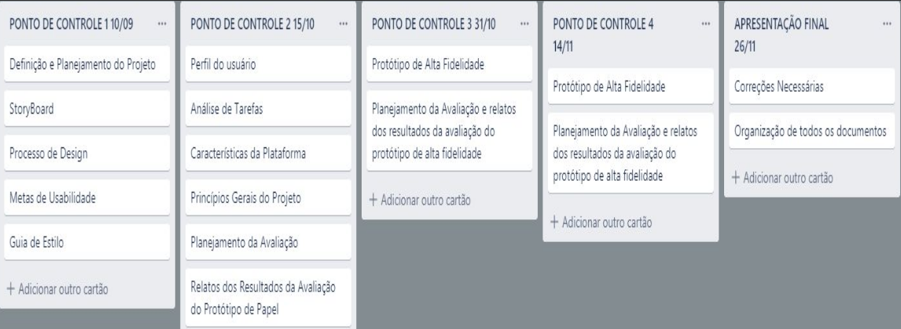

# Planejamento do Grupo 1 - Lance!

#### Professor: André Barros
#### Disciplina: Interação Humano Computador
#### Semestre: 2019/2

## Grupo

| Aluno | Matrícula | Email | Foto | 
| ----- | --------- | ----- | ---- |
| André Goretti Motta | 16/0112028 | andremotta96@gmail.com |  | 
| André Lucas Ferreira Lemos de Souza | 15/0005563 | andre.lucas.lemos@hotmail.com | |
| Ian Pereira de Sousa Rocha | 16/0124778 | ianrocha.df@gmail.com |  |
|  Luís Cláudio Telles Lima | 16/0153204| lclaudio.tl@gmail.com||
|Murilo Loiola Dantas|17/0163571|murilo.loiola.dan@gmail.com||
|Thallyz Braz|17/0045943|thallysbraz3@gmail.com||

## Ferramentas

| Ferramenta | Nome | Descrição |
|------------|------|-----------|
||ZenHub|Subsistema no GitHub que permite gestão ágil do projeto/grupo com interface KanBan.|
||GitHub|Plataforma que será utilizada para gerir e unificar aquilo que o grupo desenvolver.|
||Discord|Ferramenta de comunicação para realização de reuniões à distância e sob demanda.|
||Telegram|Ferramenta de comunicação para avisos gerais, marcar datas de reunião, entre outros.|
||Google Drive|Plataforma para permitir a edição simultânea de arquivos por todos do grupo.|

## Roadmap

 

## Versionamento

|Versão|Data|Descrição|Autor|
|---|---|---|---|
|1.0|25/11/19|Adicionando Planejamento do Grupo|Ian Rocha|