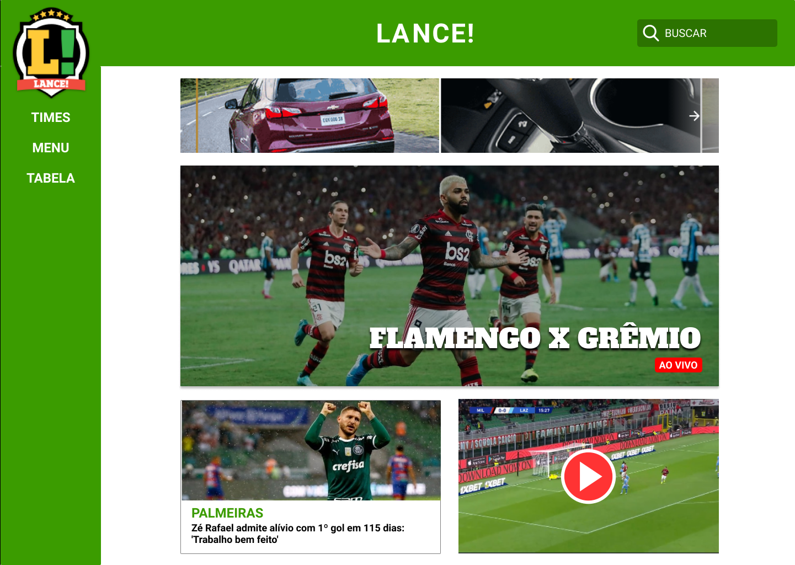

# Protótipo de alta fidelidade

#### Histórico de revisões
|   Data   |  Versão  |        Descrição       |          Autor(es)          |
|:--------:|:--------:|:----------------------:|:---------------------------:|
|03/11/2019|1.0| Iniciando o documento e adicionando protótipos |André Lucas|
|04/11/2019|1.1|Modificando documento|André Lucas| 

## 1. Introdução

Um protótipo de alta fidelidade deve se aproximar ao máximo dos aspectos visuais e funcionais do produto final, incluindo o conteúdo, fluxo de navegação e interações. São muito utilizados para testes e validação com usuários, ou para vender uma ideia, pois ver o produto “funcionando” costuma gerar fascinação.

## 2. Protótipo de alta fidelidade

Com base nas análises buscamos melhorar os principais problemas levantados em relação a usabilidade do site Lance. A partir do protótipo de papel e do planejamento da avaliação desenvolvemos o protótipo de alta fidelidade com a ferramenta **Figma**. Acesse este link para utilizar o nosso protótipo interativo: [Protótipo Lance](https://www.figma.com/file/P20DyPWi8UBMlW2FlwgCYt/2019.2-Lance?node-id=0%3A1).

### 2.1 Tela inicial do prototipo

## 3. Referências

- [Conheça os tipos de protótipos.](https://dextra.com.br/pt/baixa-media-ou-alta-fidelidade-conheca-as-diferencas-entre-os-tipos-de-prototipos/)
